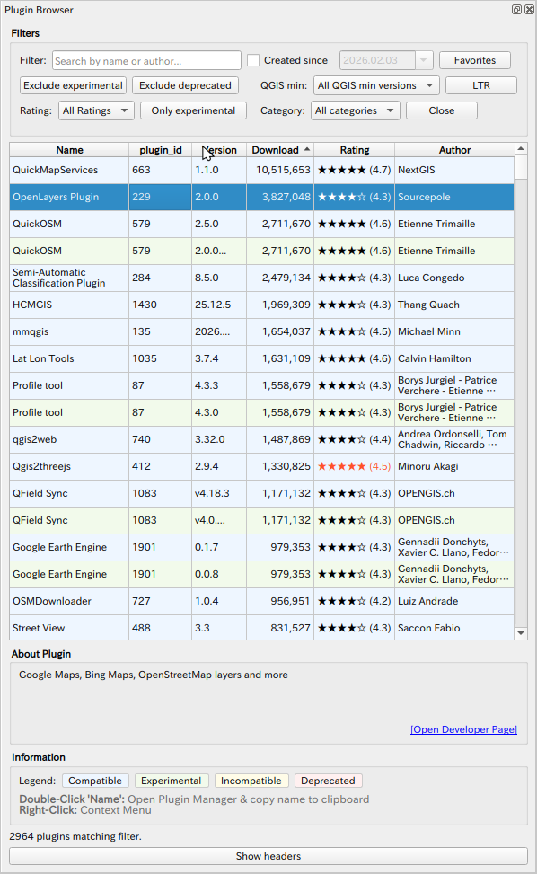

# Plugin Info Browser

A QGIS plugin that fetches the official QGIS plugin repository and displays all available plugins in a filterable, sortable table.

## Features

- Fetches live data from the QGIS official plugin repository
- Filter by name, author, plugin ID, or version text
- Filter by rating, QGIS minimum version, category, creation date
- Toggle buttons: Exclude experimental / Exclude deprecated / Only experimental
- LTR-only mode for QGIS minimum version filter
- Favorites list (persisted across sessions)
- Row color coding: Compatible (blue) / Experimental (green) / Incompatible (yellow) / Deprecated (red)
- Installed plugins highlighted in the rating column
- **Double-click** a plugin name: opens Plugin Manager and copies the plugin name to clipboard
- **Right-click**: add/remove from Favorites
- About text preview panel with link to developer page

## Usage

1. Open the plugin from the Vector menu or toolbar.
2. The plugin list loads automatically from the repository.
3. Use the filter controls to narrow down results.
4. Double-click a plugin name to open the Plugin Manager — the name is already copied to your clipboard, so you can paste it into the search field.

## Installation

Install via QGIS Plugin Manager (search for "Plugin Info Browser"), or download the ZIP from [Releases](https://github.com/raw-slnc/plugin_info/releases) and install via **Plugins → Manage and Install Plugins → Install from ZIP**.

## Requirements

- QGIS 3.16 or later
- Internet connection (to fetch the plugin repository)

## License

GNU General Public License v2 or later
